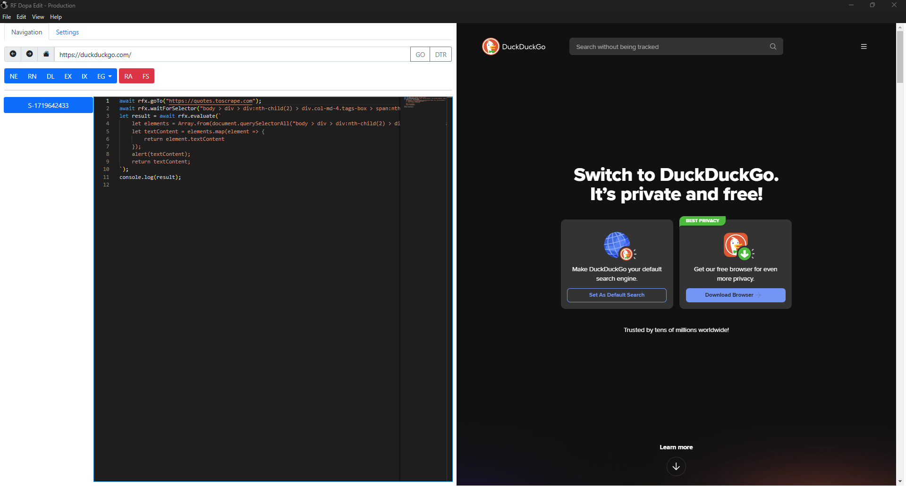

# rf_dopa_edit - Programmable Web Browser

## Pendahuluan

Aplikasi ini adalah web browser yang dapat diprogram.

## Download di Mana

Download executable-nya di halaman "Releases".

## Cara Penggunaan

Aplikasi ini terdiri dari dua panel yang masing-masing memiliki fungsinya sendiri.

Panel kiri berfungsi untuk meng-input-kan kode.

Panel kanan berfungsi untuk menampilkan hasil dari kode tersebut.

Bahasa pemrograman yang digunakan dalam aplikasi ini untuk browsing adalah JavaScript.

Aplikasi ini juga telah disertai contoh kode.

## Screenshot

	

