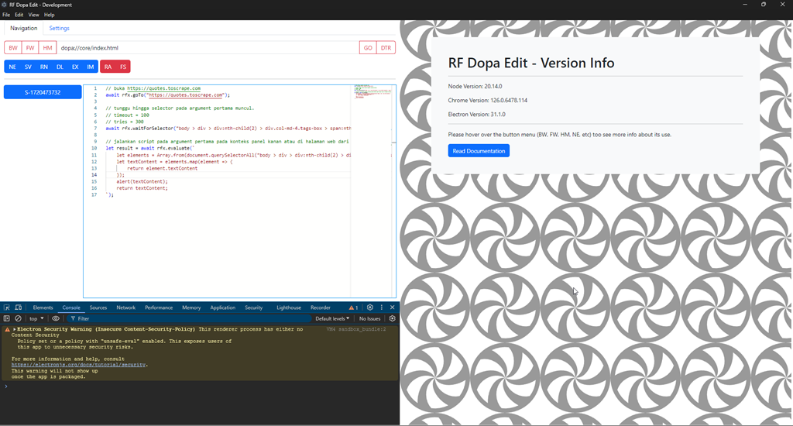

## Introduction

Using RF Dopa Edit is actually not too difficult.

The important thing is to understand the meanings of the abbreviations in its menu and be able to comprehend the example codes provided.

But first, let's start with the two panels (left and right) in the main window.



## Left Panel

The left panel of RF Dopa Edit is used for navigation and configuration.

This panel consists of two horizontal tabs:

-   Navigation
-   Settings

The "Navigation" tab is used for navigation, both through the GUI and API.

### Navigation with GUI

To navigate using the GUI, use the BW, FW, HM, and GO buttons to the left and right of the URL input box.

What do these abbreviations mean?

-   BW = Go Backward
-   FW = Go Forward
-   HM = Go Home
-   GO = Go to URL provided in input box.

### Navigation with API

To navigate using the API, you can create a new code editor tab by clicking the NE button in the menu.

Next, a code editor will appear where you can name it through the provided popup.

This code editor will be filled with code that uses the rfx API of this application to perform various tasks related to web navigation.

Details of the rfx API will be provided in the API tutorial accessible via this documentation menu.

### Settings

The "Settings" tab contains configurations for the RF Dopa Edit application that you can modify:

-   Home page
-   Useragent
-   Window Theme: BS Light or BS Dark. BS stands for Bootstrap, the CSS library used in this application.
-   Editor Theme: VS Light or VS Dark. This is the theme of the Monaco editor used in this application.
-   Save. To save the configuration.
-   Reset. To reset the configuration.

### Other Menus

Some menus have been discussed earlier, now here are the rest:

-   DTR - DevTools Right. To open devtools in the right panel.
-   SV - Save Scripts. Save all scripts in code editor tab.
-   RN - Rename Script. To rename a script that has been created.
-   DL - Delete Script. To delete a script that has been created.
-   EX - Export Scripts. To export all scripts in the tab to a JSON formatted file.
-   IM - Import Scripts. To import all scripts that have been exported using EX.
-   RA - Run Asynchronous. To execute a script within an asynchronous wrapper. This allows you to use `await` directly in the code editor.
-   FS - Force Stop. To forcibly stop a script. Useful if you have entered an infinite loop in a script in the code editor.

## Right Panel

The right panel is a preview of what you are doing in the left panel.

For example, you can open a specific URL in the URL input, then press the GO button.

Thus, in the right panel, if the URL is correct, the targeted page will open.

If an error occurs, RF Dopa Edit will display the error page in the right panel.

Additionally, the right panel also serves as a preview of what you are doing in the code editor in the left panel.

For example, you can execute:

```
rfx.goTo("https://duckduckgo.com");
```

In the code editor.

By running the script on that code, the duckduckgo page will open in the right panel.
